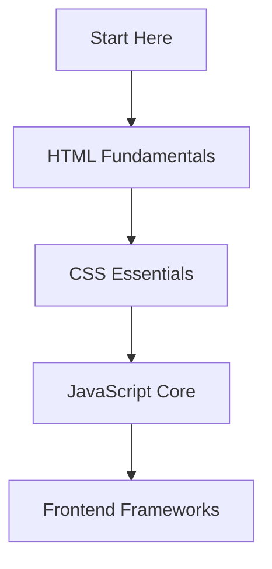

# Web Development Course Track

  Master the fundamentals of web development

  

    ⭐ 4.8
  

## Course Overview

This comprehensive track covers everything you need to know about web development, from basic HTML to advanced JavaScript concepts.

## Course Modules

### 1. HTML Fundamentals

  - Document structure
  - HTML elements and attributes
  - Forms and input elements
  - Semantic HTML
  - Best practices

  <a href="/courses/web-development/html-fundamentals" className="text-blue-600 dark:text-blue-400 hover:underline inline-flex items-center mt-4">
    Start HTML Fundamentals →
  </a>

### 2. CSS Essentials

  - Selectors and properties
  - Box model
  - Layout techniques
  - Responsive design
  - CSS frameworks

  <a href="/courses/web-development/css-basics" className="text-blue-600 dark:text-blue-400 hover:underline inline-flex items-center mt-4">
    Start CSS Basics →
  </a>

### 3. JavaScript Core

  - Basic syntax and data types
  - Functions and scope
  - DOM manipulation
  - Events and event handling
  - Modern ES6+ features

  <a href="/courses/web-development/javascript-core" className="text-blue-600 dark:text-blue-400 hover:underline inline-flex items-center mt-4">
    Start JavaScript Core →
  </a>

## Prerequisites

  - Basic computer skills
  - Text editor installed
  - Web browser
  - Enthusiasm to learn!

## Learning Path

## Course Features

  

    📝 Detailed written explanations
  

  

    💻 Interactive code examples
  

  

    ✅ Practice exercises
  

  

    🎯 End-of-module quizzes
  

## Time Commitment

  - Each module: 2-3 hours
  - Complete track: 2-3 weeks
  - Self-paced learning

  <a 
    href="/courses/web-development/html-fundamentals" 
    className="bg-blue-600 text-white px-8 py-3 rounded-lg hover:bg-blue-700 dark:bg-blue-500 dark:hover:bg-blue-600 inline-flex items-center"
  >
    Begin Your Journey →
  </a>

